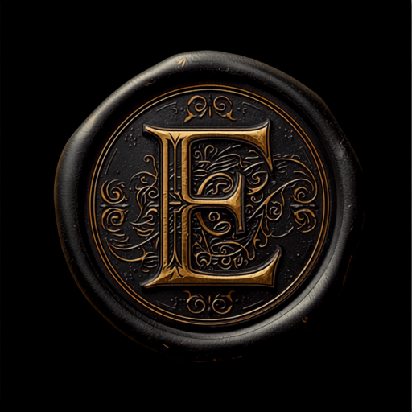

<!DOCTYPE html>
<html lang="en">
<head>
<meta charset="UTF-8">
<meta name="viewport" content="width=device-width, initial-scale=1.0">
<title>FREE Cinematic Arrival Scene · for Curse of Strahd DMs · EndoCraft</title>
<meta name="description" content="A free, table-ready cinematic arrival scene for your Curse of Strahd game — the carriage, the village, the castle, the lord. Straight to your inbox.">
<link rel="canonical" href="https://endocraft.app/free/">
<meta property="og:title" content="FREE Cinematic Arrival Scene · for Curse of Strahd DMs · EndoCraft">
<meta property="og:description" content="Play your players the valley. A free table-ready arrival scene for Curse of Strahd — straight to your inbox.">
<meta property="og:image" content="https://endocraft.app/free/og-image.jpg">
<meta property="og:type" content="website">
<meta property="og:site_name" content="EndoCraft">
<meta property="og:url" content="https://endocraft.app/free/">
<meta name="twitter:card" content="summary_large_image">
<meta name="twitter:title" content="FREE Cinematic Arrival Scene · for Curse of Strahd DMs · EndoCraft">
<meta name="twitter:description" content="Play your players the valley. A free table-ready arrival scene for Curse of Strahd.">
<meta name="twitter:image" content="https://endocraft.app/free/og-image.jpg">
<link rel="preconnect" href="https://fonts.googleapis.com">
<link href="https://fonts.googleapis.com/css2?family=Cinzel:wght@500;700;900&family=Cinzel+Decorative:wght@700;900&family=EB+Garamond:ital@0;1&family=DM+Sans:wght@400;500;700&family=Cormorant+Garamond:ital,wght@1,500;0,700&display=swap" rel="stylesheet">

<link rel="icon" type="image/png" sizes="64x64" href="../assets/favicon-64.png">
<link rel="icon" type="image/png" sizes="32x32" href="../assets/favicon-32.png">
<link rel="apple-touch-icon" href="../assets/apple-touch-icon.png">
</head>
<body>

<nav class="nav">
  
ENDOCRAFT

</nav>

<section class="hero">
  

    Free · for Curse of Strahd dungeon masters
    <h1>Play them the valley.</h1>
    
A cinematic arrival scene — <b>table-ready</b>. Play it the moment your party crosses into the valley, and let the mist do the talking.

    

      The Arrival · free scene
      <video id="film" src="clips/arrival-cursed-valley.mp4" poster="arrival-poster.jpg" muted autoplay loop playsinline preload="auto"></video>
      <button class="sound-btn" id="soundBtn" type="button">♪ Sound on</button>
    

    <form class="form" id="leadForm">
      

        <input type="email" id="email" placeholder="your@email.com" required autocomplete="email">
        <button class="btn-primary" type="submit" id="submitBtn">Send me the scene →</button>
      

      

    </form>
    
The full <b>1080p MP4</b> lands in your inbox — yours to play at the table. No spam, unsubscribe anytime.

    

      Only 9 free spots left today
      <a class="badge gw" href="https://www.tiktok.com/@theendocraft" target="_blank" rel="noopener">▸ Follow <b>@theendocraft</b> on TikTok — the scene enters you in this month's <b>free custom-clip giveaway</b></a>
    

    
  

</section>

<!-- ===== secondary: what else we make ===== -->
<section class="v2sec">
  

    
This is just a taste

    <h2 class="v2h">We turn campaigns into cinema.</h2>
    
Character cutscenes, boss reveals, whole-campaign trailers — cinematic NPC cards, VTT tokens &amp; location art, print-ready for Roll20 &amp; Foundry. Code <b>WELCOME10</b> &mdash; 10% off your first pack

    

      <a class="v2tile" href="https://www.etsy.com/listing/4531234914?utm_source=endocraft&utm_medium=free_page&utm_campaign=shop_dh" target="_blank" rel="noopener"><video src="shop/tile_dh.mp4" poster="shop/tile_dh_poster.jpg" muted autoplay loop playsinline preload="metadata"></video>
The Devil&rsquo;s Hound<small>Curse of Strahd encounter kit</small>
</a>
      <a class="v2tile" href="https://www.etsy.com/listing/4530867864?utm_source=endocraft&utm_medium=free_page&utm_campaign=shop_bloomrot" target="_blank" rel="noopener"><video src="shop/tile_bloomrot.mp4" poster="shop/tile_bloomrot_poster.jpg" muted autoplay loop playsinline preload="metadata"></video>
The Bloomrot Saint<small>Boss encounter kit</small>
</a>
      <a class="v2tile" href="https://www.etsy.com/listing/4528139082?utm_source=endocraft&utm_medium=free_page&utm_campaign=shop_dragons" target="_blank" rel="noopener"><video src="shop/tile_dragons.mp4" poster="shop/tile_dragons_poster.jpg" muted autoplay loop playsinline preload="metadata"></video>
Animated Dragons<small>Living encounter clips</small>
</a>
      <a class="v2tile" href="https://www.etsy.com/listing/4528136284?utm_source=endocraft&utm_medium=free_page&utm_campaign=shop_ambience" target="_blank" rel="noopener"><video src="shop/tile_ambience.mp4" poster="shop/tile_ambience_poster.jpg" muted autoplay loop playsinline preload="metadata"></video>
Animated Ambience<small>Living location scenes</small>
</a>
    

    <a class="v2btn" href="https://www.etsy.com/shop/EndoCraft?utm_source=endocraft&utm_medium=free_page&utm_campaign=shop_all" target="_blank" rel="noopener">Browse the full shop on Etsy &rarr;</a>
  

</section>

<footer class="foot">
  
  
EndoCraft · <a href="https://endocraft.app">endocraft.app</a> · cinematic D&amp;D, made to order 
  Compatible with any 5e game — not affiliated with Wizards of the Coast.

</footer>

  

    <h2>The scene is on its way 🕯️</h2>
    
Check your inbox — your <b>table-ready arrival scene</b> is landing now. Not there in a minute? Peek in your spam folder.

    

      
Want your OWN campaign like this?

      
We build custom arrival scenes, character cutscenes &amp; whole-campaign trailers — made to order, one revision on us.

      <a href="https://www.etsy.com/shop/EndoCraft?utm_source=endocraft_free&amp;utm_medium=thank_you&amp;utm_campaign=made_to_order" target="_blank" rel="noopener" style="font-family:'Cinzel',serif;font-size:12px;letter-spacing:1px;text-transform:uppercase;border-bottom:1px solid var(--gold-dim);padding-bottom:1px">See what we make →</a>
    

    
Prepping the whole campaign? The Curse of Strahd packs are 10% off with <b>WELCOME10</b> · <a href="https://www.etsy.com/shop/EndoCraft?utm_source=endocraft_free&amp;utm_medium=thank_you&amp;utm_campaign=welcome10" target="_blank" rel="noopener">Browse on Etsy →</a>

  

</body>
</html>
